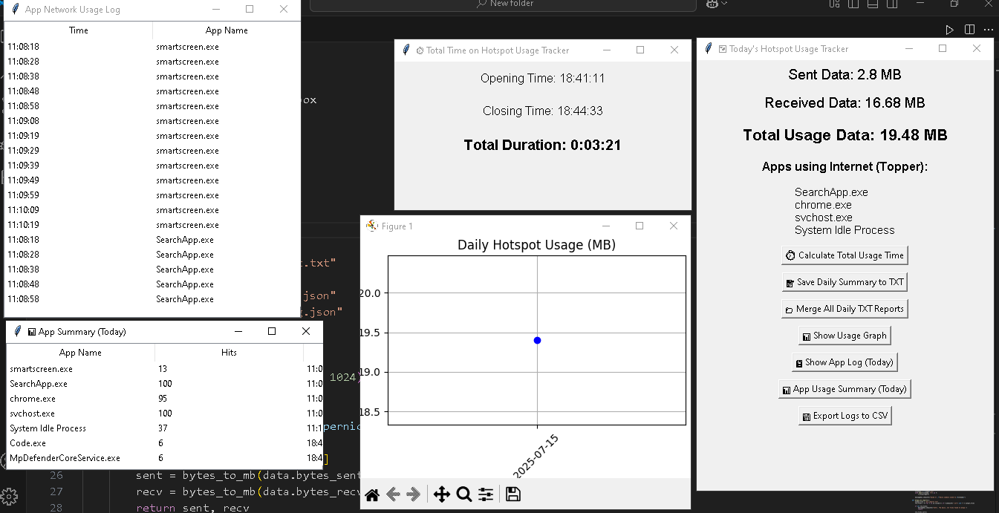

# 📶 Hotspot Usage Tracker – Python GUI App

A simple yet powerful Python GUI app that helps you track **daily internet usage**, especially from **Wi-Fi/hotspot**, and shows which apps are using your internet in real time.

## 🔗 Screenshots

➡️ 

---

## 🚀 Features

- 📊 **Real-Time Monitoring** of Sent, Received, and Total Data over Wi-Fi
- 🧠 **Per-App Network Logging** — see which apps used the internet
- 📅 **Daily Usage History Graph**
- ⏱️ **Opening, Closing, and Total Session Time**
- 📝 **Save Daily Report** as `.txt` (date-wise)
- 📁 **Merge All .txt Reports** into a single file (`all_reports.txt`)
- 💾 **Export Logs** to CSV (summary + app usage log)
- ⚠️ **Data Limit Alert** with sound + popup
- 🪟 Built with **Tkinter GUI** (no internet required)

---
## 📁 Files Generated

| File Name                  | Purpose                                    |
|----------------------------|--------------------------------------------|
| `data_usage_record.json`  | Tracks sent/received data per day/month    |
| `app_usage_log.json`      | Logs which apps accessed internet          |
| `YYYY-MM-DD.txt`          | Daily report with duration, usage, apps    |
| `all_reports.txt`         | Merged text report of all `.txt` files     |
| `daily_usage.csv`         | CSV of daily sent/received data            |
| `app_log.csv`             | Raw timestamp log of app network access    |
| `app_summary.csv`         | Per-app summary with hit count & duration  |

---

## 🛠️ How to Run

### 1. ✅ Prerequisites

Make sure you have:

- Python 3.10 or higher installed
- Admin access (for per-app network info on Windows)

### 2. ✅ Install dependencies

Open terminal or CMD and run:

    pip install psutil matplotlib

### 3. 🚀 Run Locally

On Windows, run this file as Administrator(Windows Terminal or Command Prompt):
   
    python app.py

You’ll see a live GUI with usage info and buttons for:

- Viewing graphs

- Viewing logs

- Exporting to CSV

---

⚠️ Important Notes

- Must run as Administrator to access full per-process network data.

- Only tracks data from the Wi-Fi/hotspot interface (default is "Wi-Fi").

- Daily limit set to 500 MB
  ➜ Change DAILY_LIMIT_MB = 500 as per your needs.

- Can be customized for "Ethernet" or other interfaces.

---

### [OPTIONAL] Windows Default Open Resource Monitor

Press Win + R to open Run

Type:

    resmon
Press Enter

Go to the Network tab

### 📊 What You'll See
🔸 Processes with Network Activity:

   Shows which .exe or process is using network
   Sortable by Send (B/sec) or Receive (B/sec)

🔸 Network Activity:

   Shows total amount of data used by each app, live

🔸 TCP Connections:

   Shows which app is connected to which remote IP
   
---
🧠 Future Ideas 

- 📊 Show top data-consuming apps

- ☁️ Sync logs to cloud

- 🔔 Auto-email daily report

- ✅ Dark mode UI

- ✅ Background tray mode

- ✅ Hotspot timer mode

### 📜 License

    This project is open source and available under the MIT License.

---

### 👨‍💻 Author

- Made with ❤️ by Pranab Mahata
- [GitHub](https://github.com/rnccsstudent)

---

### 💬 Feedback

      If you find a bug or want to suggest a feature, feel free to open an issue or a pull request.

---
